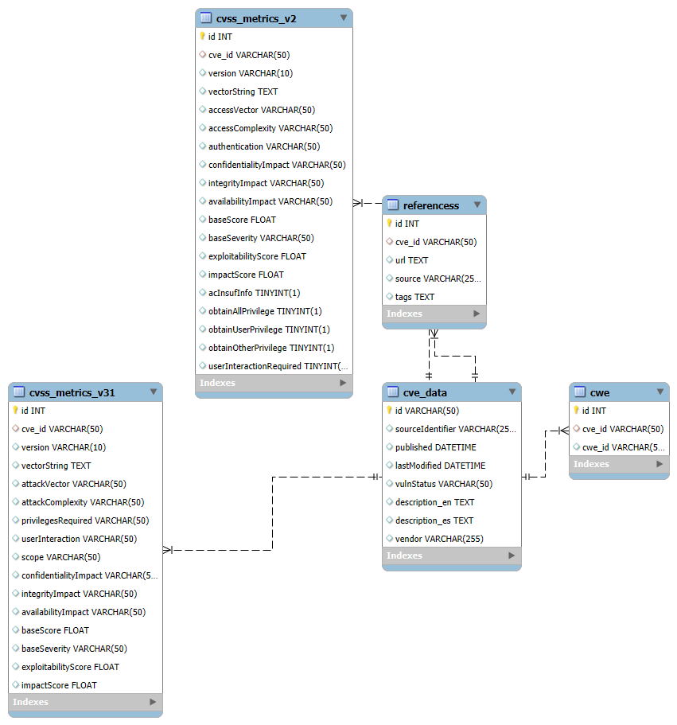

# Analista Junior de Sección Metodologías ORM

## 1. CVE de NIST

### Descripción del Proyecto

Este proyecto está diseñado para gestionar y analizar datos relacionados con las vulnerabilidades de seguridad (CVE) proporcionados por el NIST. La estructura del proyecto se organiza en dos carpetas principales: `Tools` y `Sql`.

### Estructura del Proyecto

#### Carpeta Tools

La carpeta `Tools` contiene dos scripts principales:

- **CreateDB.py**: Este script incluye funciones para crear la base de datos y las tablas necesarias en MySQL. Para su funcionamiento, utiliza la configuración proporcionada en el archivo `Parameters.json`, ubicado en la carpeta `config`. Este archivo contiene la configuración necesaria para conectar con la base de datos MySQL.

- **Functions.py**: Contiene diversas funciones auxiliares que facilitan el flujo del proyecto, tales como:
  - Lectura de archivos `.json` y `.csv`.
  - Consumo de APIs para extraer información.
  - Funciones para guardar datos en la base de datos.
  - Análisis y clasificación de sentimientos, utilizada para analizar algunos resultados obtenidos.

#### Carpeta Sql
En la carpeta `Sql` contiene 1 archivo el cual contiene todas las consultas sql para crear base de datos y tablas enlazandolas con una llave foranea 
### Estructura de la Base de Datos

La estructura de la base de datos está diseñada para almacenar y relacionar información obtenida de las APIs y los archivos de datos. Incluye las tablas necesarias para registrar las vulnerabilidades CVE, métricas de CVSS, datos de CWE, y resultados de análisis de sentimientos.

#### Carpeta Documents 
En la capera `Documents` se encuentra el archivo `known_exploited_vulnerabilities (2).csv` el cual contiene los ids para ser usados como endpoints en la api

#### Archivo main.py

El archivo `main.py`, ubicado en la raíz del directorio, coordina la ejecución de las funciones de los scripts anteriores. Sus responsabilidades incluyen:

- Crear la base de datos utilizando `CreateDB.py`.
- Consumir la API y extraer datos a partir de los valores obtenidos de los endpoints especificados en la carpeta `documentos`.
- Leer archivos `.csv` y realizar consultas a la API para cada ID, con el fin de extraer información y almacenarla en las tablas correspondientes de la base de datos.

#### Carpeta Backend
# Backend de Análisis de CVE

Esta aplicación backend proporciona una API basada en Flask para analizar datos de Vulnerabilidades y Exposiciones Comunes (CVE). Ofrece varios endpoints para recuperar y visualizar información de CVE, métricas CVSS y datos de CWE (Enumeración de Debilidades Comunes).

## Configuración

1. Asegúrate de tener Python y las bibliotecas requeridas instaladas (Flask, mysql-connector, pandas, nltk, plotly, textblob).
2. Configura tu base de datos MySQL y actualiza el archivo `Parameters.json` con tu configuración de base de datos.
3. Ejecuta el script: `python app.py`

## Endpoints de la API

### 1. Análisis de Sentimientos

- **Endpoint:** `/api/sentiment`
- **Método:** GET
- **Descripción:** Realiza un análisis de sentimientos en las descripciones de CVE y devuelve un resumen de las puntuaciones de sentimiento.

### 2. Análisis de Frecuencia de Palabras

- **Endpoint:** `/api/word-frequency`
- **Método:** GET
- **Descripción:** Analiza la frecuencia de palabras en las descripciones de CVE y devuelve un gráfico de barras de las palabras más comunes.

### 3. Diferencias de Puntuación CVSS

- **Endpoint:** `/api/score-differences`
- **Método:** GET
- **Descripción:** Compara las puntuaciones CVSS v3.1 y v2.0 (Explotabilidad, Impacto, Puntuación Base y Severidad Base) y devuelve gráficos de distribución de las diferencias.

### 4. Vulnerabilidades CWE a lo Largo del Tiempo

- **Endpoint:** `/api/cwe-vulnerabilities`
- **Método:** GET
- **Descripción:** Visualiza el número de vulnerabilidades por ID de CWE a lo largo del tiempo.

### 5. Tabla de Métricas CWE-CVE

- **Endpoint:** `/api/cwe-cve-metrics_table`
- **Método:** GET
- **Descripción:** Devuelve los CWE principales basados en varias métricas CVSS tanto para v3.1 como para v2.0.

### 6. Gráfico Superior de Métricas CWE-CVE

- **Endpoint:** `/api/cwe-cve-metrics_top_graph`
- **Método:** GET
- **Descripción:** Genera gráficos de barras para los CWE principales basados en diferentes métricas CVSS.

### 7. Gráfico de Correlación de Métricas CWE-CVE

- **Endpoint:** `/api/cwe-cve-metrics_corre_graph`
- **Método:** GET
- **Descripción:** Crea un mapa de calor de correlación entre las métricas CVSS v3.1 y v2.0.

### 8. Gráfico de Dispersión de Métricas CWE-CVE

- **Endpoint:** `/api/cwe-cve-metrics_Scatterplot`
- **Método:** GET
- **Descripción:** Genera un gráfico de dispersión de la Puntuación de Explotabilidad vs la Puntuación de Impacto para CVSS v3.1.

### 9. Información Detallada de CVE

- **Endpoint:** `/api/get_cve_info_detail`
- **Método:** POST
- **Descripción:** Recupera información detallada sobre un CVE específico, incluyendo métricas CVSS y CWE asociados.

## Características Principales

1. **Integración de Base de Datos:** Utiliza MySQL para almacenar y recuperar datos de CVE.
2. **Visualización de Datos:** Utiliza Plotly para crear gráficos e infografías interactivas.
3. **Procesamiento de Lenguaje Natural:** Implementa análisis de sentimientos y análisis de frecuencia de palabras en las descripciones de CVE.
4. **Comparación CVSS:** Proporciona herramientas para comparar métricas CVSS v3.1 y v2.0.
5. **Análisis CWE:** Ofrece varios endpoints para analizar datos CWE en relación con los CVE.

## Notas Importantes

- La aplicación utiliza un archivo de configuración (`Parameters.json`) para la configuración de la base de datos. Asegúrate de que este archivo esté configurado correctamente.
- Se utiliza NLTK para el procesamiento de texto. Asegúrate de descargar los datos de NLTK requeridos.
- El backend está diseñado para trabajar con un esquema de base de datos específico. Asegúrate de que la estructura de tu base de datos coincida con el esquema esperado.

## Manejo de Errores

- La aplicación incluye manejo básico de errores para problemas de conexión a la base de datos y solicitudes inválidas.
- Los mensajes de error detallados se registran para fines de depuración.

## Mejoras Futuras

- Implementar autenticación de usuario para acceso seguro a datos sensibles.
- Añadir mecanismos de caché para mejorar el rendimiento de los datos accedidos con frecuencia.
- Ampliar el manejo de errores y la validación de entrada para una operación más robusta. 

